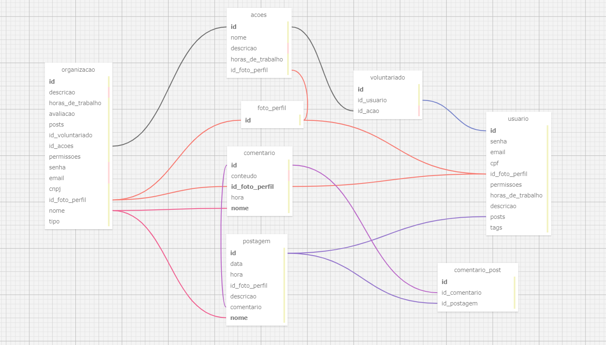

# PonderadaSQL
## Visão Geral:
Nossa aplicação requer uma estrutura de banco de dados robusta que possa representar e gerenciar eficientemente as relações entre entidades. Para isso, aplicamos os princípios de relacionamento 1:N e N:N.

 

 

## Tabelas Principais
organizacao: Armazena propriedades específicas às instituições.

usuario: Registra dados de usuários que apenas um cadastro possui.

postagem: Registra informações das postagens.

comentario: Registra comentarios feitos na plataforma.

## Tabelas Auxiliares

foto_perfil: Registra link (imgur provavelmente) para foto de usuários.

tipo: Registra as possíveis categorias de instituição.

voluntariado: Relação usuários e ações.

## usuario-foto_perfil:

Entidade Principal: usuario

Entidade Relacionada: foto_perfil

Relacionamento: Um usuario pode ter uma foto de perfil, e uma foto de perfil pertence a um unico usuário.

Relacionamento 1:1

## acoes-usuario:

Entidades Envolvidas: acoes e usuario

Relacionamento: Um usuario pode realziar varias ações e uma ação pode pertencer a apenas um usuario.

Relacionamento: 1:N

## post-comentario:

Entidades Envolvidas: post e comentario

Relacionamento: Um post pode ter varios comentarios e um comentario só pode pertencer a um post.

Relacionamento: 1:N

## permissoes-usuario:

Entidades Envolvidas: permissoes e usuario

Relacionamento: Um usuario pode ter varias permissoes e uma permissao pode pertencer a varios usuarios.

Relacionamento: N:N
